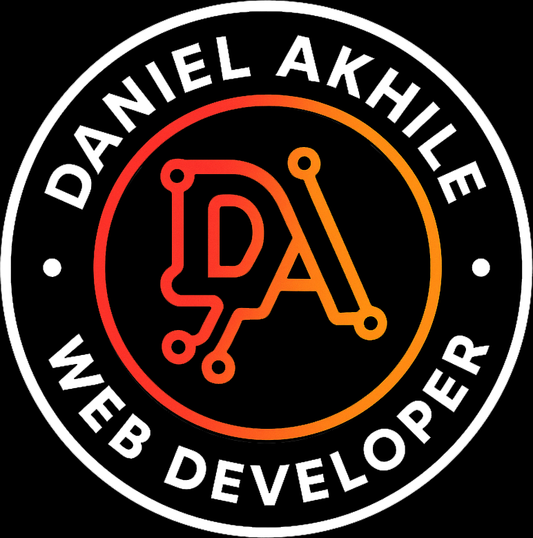
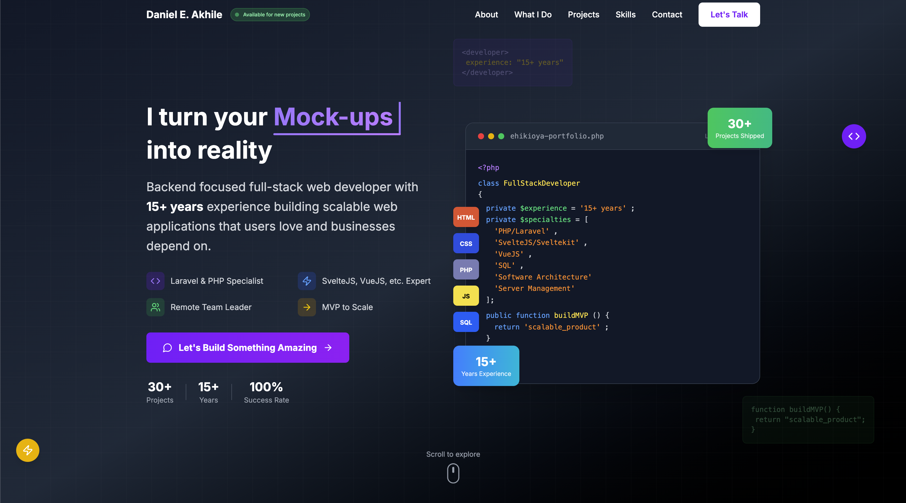

<div align="center">
  <a href="https://daniel.stafr.pro">
    
  </a>
</div>

<h1 align="center">
  Daniel's Portfolio Website
</h1>

[](https://daniel.stafr.pro)
[](https://github.com/xavi7th/portfolio-site/commits/main)
[](https://github.com/xavi7th/portfolio-site)

Welcome to the source code of my personal portfolio website! This site showcases my skills, projects, and professional journey as a developer.


*Screenshot caption: Showcasing the responsive design and modern UI of my portfolio*

## 🚀 Features

- **Modern UI/UX Design**: Clean, responsive layout with attention to detail
- **Performance Optimized**: Fast loading times and smooth animations
- **Responsive Design**: Works flawlessly on all device sizes
- **Interactive Elements**: Engaging user interactions
- **SEO Optimized**: Proper metadata and structured data
- **Dark/Light Mode**: User preference detection

## 🛠️ Technologies Used

### Frontend
- Sveltekit / Svelte 5 using runes mode
- CSS/SASS with modern layout techniques (Flexbox/Grid)
- TailwindCSS 4, Shadcn UI, Prettier, CI/CD Scaffold, etc.
- JavaScript ES6+ with clean, modular code

### Build & Deployment
- Vite
- GitHub Actions for CI/CD
- VPS / Shared hosts for hosting

## 🏗️ Project Structure

```
├── src/
│   ├── lib/                 # Reusable UI components
│   │    ├── utils.js        # Reusable utilities
│   │    ├── assets/         # Images, fonts, etc.
│   │    └── components/     # Reusable UI components & page sections (About, Projects, etc.)
│   ├── routes/              # Routes and pages for svelte app
│   ├── loader.cjs           # Custom loader for shared hosting servers
│   ├── app.css              # Global styles, CSS modules, & TailwindCSS customizations
│   └── app.html             # Main application app shell
├── static/                  # Static files
└── package.json             # Project dependencies
```

## 🌟 Highlights

- Custom-designed UI components
- Accessibility best practices (WCAG compliant)
- Optimized image loading
- Contact form with serverless function integration

## 🚧 Installation

To run this project locally:

1. Clone the repository:
   ```bash
   git clone https://github.com/xavi7th/portfolio-site.git
   ```
2. Install the dependencies:
   ```bash
   bun install
   ```
3. Start development server:
   ```bash
   bun run dev -- --open
   ```

## Building

To create a production version of your app:
```bash
bun run build
```

You can preview the production build with `bun run preview`.

> To deploy your app, you may need to install an [adapter](https://svelte.dev/docs/kit/adapters) for your target environment.


## 📄 License

This project is open source and available under the [MIT License](LICENSE.md).

## 📬 Contact

Have questions or want to collaborate? Reach out to me through:
- Portfolio: [daniel.stafr.pro](https://daniel.stafr.pro)
- Email: [ehi.akhile@gmail.com](ehi.akhile@gmail.com)
- LinkedIn: [https://www.linkedin.com/in/danielose/](https://www.linkedin.com/in/danielose/)
- Telegram [Leinad8th](https://t.me/Leinad8th)

---

✨ Crafted with passion by [Daniel E. A.](https://daniel.stafr.pro)
